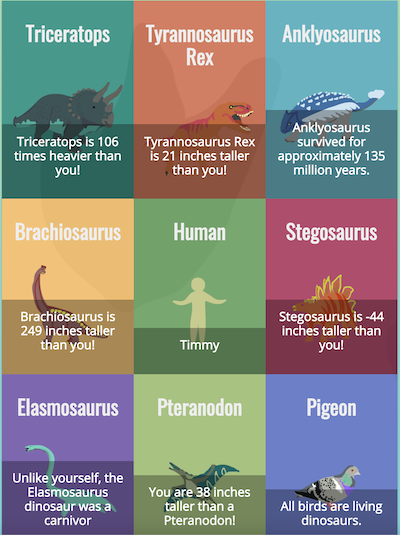

# Dinographic
A JavaScript application that displays the results of comparing a human against a dinosaur.
A user is able to submit their information through a form and view a grid of infograpics.
This is the first project in [Udacity's Intermediate JavaScript Nanodegree program](https://www.udacity.com/course/intermediate-javascript-nanodegree--nd032).

### Installation
In order to run Dinographic locally;

1. Clone the repo
2. Using `Terminal`, navigate into the directory
3. Execute `npx serve` or `sudo npx serve`

### Author
Jon Sweeney
